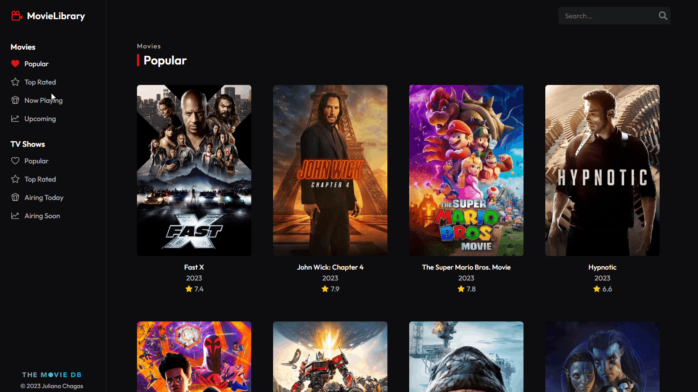
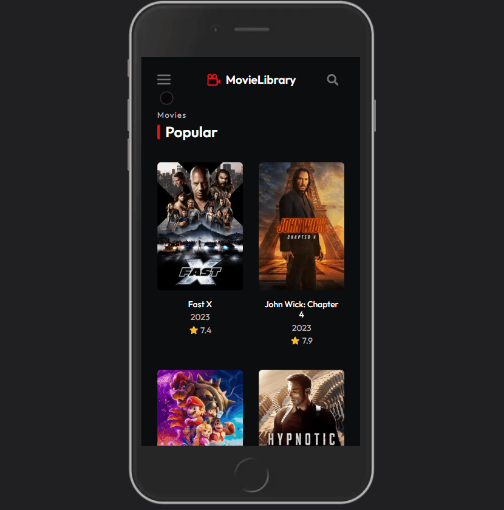

# Movie Library 🎥

A Movie and TV Shows Library built with ReactJS and TypeScript using The Movie Database API.

## 🛠️ Technologies

- React JS
- TypeScript
- React Router
- Styled Components

## 🌐 API

- [TMDB - The Movie Database API](https://developers.themoviedb.org/3/getting-started/introduction)

## 🔗 Link

- [Movie Library: Live Website](https://movie-library-julianachagas.netlify.app/)

## Preview

- Web

 <br/><br/>

- Mobile

 <br/><br/>

## 💡 Features

✔️ Check the list of movies in four different categories: Popular, Top Rated, Upcoming, and Now Playing; \
✔️ Check the list of TV Shows in four different categories: Popular, Top Rated, Airing Today, and Airing Soon; \
✔️ The list displays the poster, title, release year, and rating of each movie/tv show \
✔️ Click on a specific movie/tv show to view more details like overview, release date, genres, status, etc. \
✔️ Search for movies and TV Shows \
✔️ Pagination: user can use the links "back" and "next" to navigate between the list pages\
✔️ Responsiveness \
✔️ Animated loader while fetching the data from the API \
✔️ Image skeleton: animated placeholder while the poster is being loaded

## ⚙️ How to use

You'll need [Node.js](https://nodejs.org/en/) and [Git](https://git-scm.com) installed to run this application on your computer.

- Installing

```bash
# Clone this repository
$ git clone https://github.com/julianachagas/movie-library.git

# Go into the repository
$ cd movie-library

# Install the dependencies
$ npm install
```

- Requisites

You need to create an API KEY in [The Movie Database API Website](https://developer.themoviedb.org/docs/getting-started). Then, create an .env file on the root of the project and put your API key:

```
VITE_API_KEY = 'yourapikeyhere';
```

- Development and Deployment:

```bash
# Run the app in development mode
$ npm run dev

# Build the app for production to the 'dist' folder
$ npm run build

# Preview the production build locally
$ npm run preview
```

## 📚 Useful Resources

- [Environment variables in a Vite-built React App:](https://devzibah.hashnode.dev/using-a-dotenv-file-to-store-and-use-api-keys-in-a-vite-built-react-app)
- [How to Hide Your API Keys](https://betterprogramming.pub/how-to-hide-your-api-keys-c2b952bc07e6)
- [Changing Tag Type When Extending Component in Styled-Components](https://stackoverflow.com/questions/56651064/changing-tag-type-when-extending-component-in-styled-components)

## 👩🏻‍💻 Author

<a href="https://www.linkedin.com/in/juliana--chagas/" target="_blank"></a>
<a href="https://twitter.com/JulianaCoding" target="_blank"></a>

---

##### Made with 💜 by Juliana Chagas
